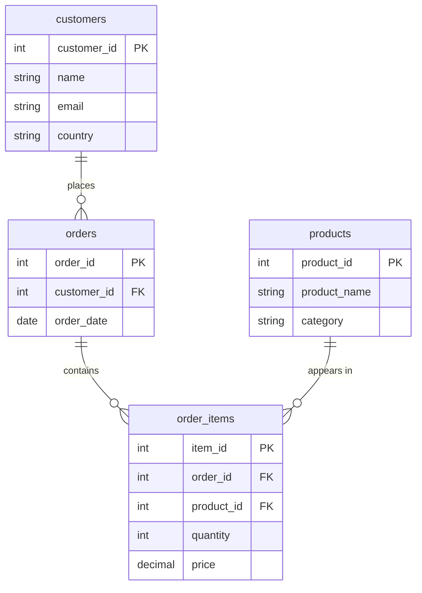

# Elevate_Labs_Task_3 — SQL for Data Analysis

This task focuses on using SQL to analyze ecommerce data.  
The goal is to demonstrate querying, joining, grouping, subqueries, views, and indexing.

## PDF LINK 

Elevate_Labs_Task_3 — SQL for Data Analysis PDF - https://www.canva.com/design/DAG7N2eUefw/yuEvd6zU9YGmgm04_62u1g/edit?ui=e30
---

## Files Included
| File | Description |
|------|-------------|
| `Task_3_sql_queries.sql` | MySQL-compatible SQL script with comments explaining each step. |
| `Task_3_sql_queries.pdf` | PDF containing outputs of executed SQL queries. |
| `README.md` | Documentation and summary of the task. |

---

## Database Structure ( Mermaid ERD)

**Database Name:** `Ecommerce_SQL_Database`

## Relationship Explanation

### 1. customers → orders  (One-to-Many)
A single customer can place multiple orders.  
This is represented by:

- `customers.customer_id` (PK)  
-  referenced by `orders.customer_id` (FK)

Meaning:  
**One customer can have many orders**, but each order belongs to only one customer.

---

### 2. orders → order_items  (One-to-Many)
Each order can contain multiple items.  
This is represented by:

- `orders.order_id` (PK)  
- referenced by `order_items.order_id` (FK)

Meaning:  
**One order contains many order_items**, but each order_item row belongs to only one order.

---

### 3. products → order_items  (One-to-Many)
A product can appear in many different orders.  
This is represented by:

- `products.product_id` (PK)
- referenced by `order_items.product_id` (FK)

Meaning:  
**One product can be purchased in many order_items**, but each order_item refers to only one product.

---

### Overall Design Summary
This database follows a standard ecommerce structure:

- **customers** place **orders**  
- each **order** contains several **order_items**  
- each **order_item** points to a **product**

This design is normalized, avoids data duplication, and supports all analytical queries used in this task.

---

## Tools Used
- MySQL Server  
- MySQL Workbench

---

## Key Concepts Demonstrated
### 1. Basic SQL Operations
- SELECT  
- WHERE  
- ORDER BY  

### 2. Joins
- INNER JOIN  
- LEFT JOIN  
- RIGHT JOIN (MySQL supported)  

### 3. Aggregate Functions & Grouping
- SUM()  
- GROUP BY  
- HAVING  

### 4. Subqueries
Used to compute top customers by spending.

### 5. Views
Created a reusable view `customer_sales` for aggregated customer-level revenue.

### 6. Indexing
Indexes added to improve query performance when joining and filtering tables.

---

## How to Run the SQL Script
1. Open MySQL Workbench.  
2. Load the script file:  
   **File → Open SQL Script → `Task_3_sql_queries_.sql`**  
3. Run the entire script using **Run All (Ctrl + Shift + Enter)** to create the database and insert data.   

---

## Screenshot
Screenshots taken for:

1. `SELECT * FROM customers;`  
2. `SELECT * FROM orders;`  
3. `SELECT * FROM products;`  
4. `SELECT * FROM order_items;`  
5. Revenue by country query  
6. Revenue by category query  
7. INNER JOIN output  
8. LEFT JOIN output  
9. RIGHT JOIN output  
10. Subquery (Top 5 spending customers)  
11. ARPU ( Average Revenue Per User ) calculation  
12. View creation success message  
13. `SELECT * FROM customer_sales ORDER BY total_spent DESC;`  
14. Index creation success message  

---
## 🧑‍💻 Author - MOHAMMAD SHARJEEL YAZDANI

This project was completed as part of a Data Analyst Internship assignment ( Elevate Labs ).

